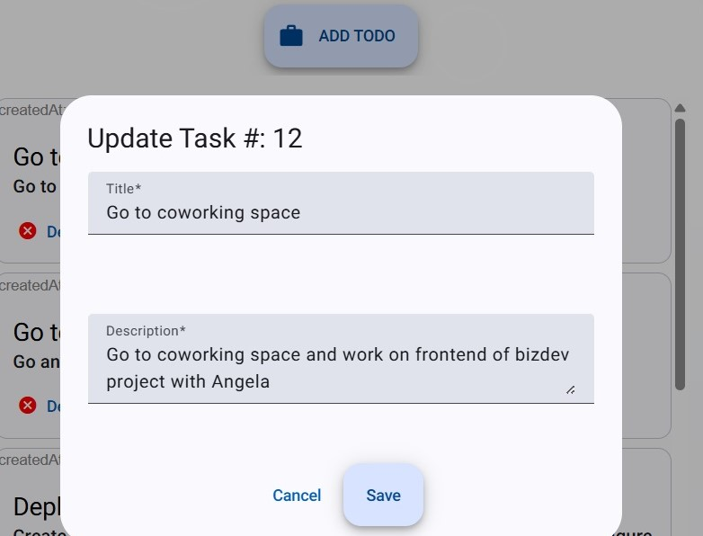

# 📝 Full-Stack To-Do List Application

A full-stack To-Do List application built with **Node.js**, **Angular**, and **MySQL**,  It supports task creation, editing, deletion, and listing all with pagination through a clean Angular interface.

## 📦 Technologies Used

- **Frontend**: Angular 20 (with optional SSR)
- **Backend**: Node.js 22 + Express + Sequelize with swagger docs and Joi validation
- **Database**: MySQL 8
- **Containerization**: Docker, Docker Compose

---
## 🔧 Project Structure

```
FULLSTACK TO-DO/
├── backend/             # Node.js Express API
├── frontend/            # Angular frontend (manual start)
├── docker/
│   ├── backend/         # Backend Dockerfile
│   └── frontend/        # Frontend Dockerfile
├── docker-compose.yml   # Docker setup for backend + DB
└── README.md
```

---

## 🚀 Getting Started

### 🐳 Backend + MySQL via Docker

#### 1. Prerequisites

- Docker and Docker Compose installed

#### 2. Run the backend and database

In the root directory:

```bash
docker-compose up --build
```

This will:
- Start a MySQL container (with database `fullstacktodoapp` created automatically)
- Build and start the Node.js backend on `http://localhost:8885`

---

### 🌐 Frontend (Angular 20)

The frontend is **not yet** containerized. To run it manually:

#### 1. Prerequisites

- Node.js  22+
- Angular CLI 20+

#### 2. Install dependencies

```bash
cd frontend
npm install
```

#### 3. Run the app

```bash
ng serve
```

Angular will serve the app at:

```
http://localhost:4200

---

## 🌍 API Endpoints (Backend)

All API requests should be made to `http://localhost:8885/api/tasks`

| Method | Endpoint          | Description        |
|--------|-------------------|--------------------|
| GET    | `/api/tasks`      | Get all tasks      |
| GET    | `/api/tasks/:id`  | Get a single task  |
| POST   | `/api/tasks`      | Create a new task  |
| PUT    | `/api/tasks/:id`  | Update a task      |
| DELETE | `/api/tasks/:id`  | Delete a task      |


📘 **Swagger API Documentation available at**: [http://localhost:8885/api-docs/](http://localhost:8885/api-docs/)

---

## 📋 Features

✅ Add a task  
✅ Edit a task  
✅ Delete a task  
✅ List all tasks  
✅ Responsive UI built with Angular Material  
✅ Dockerized backend and MySQL setup  
✅ SSR-ready Angular frontend (optional future enhancement)

---
---

## 👨‍💻 Author

Developed by JOTSA Mikael as part of a Full-Stack Challenge.